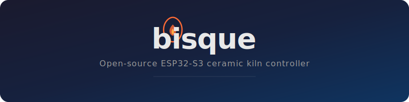
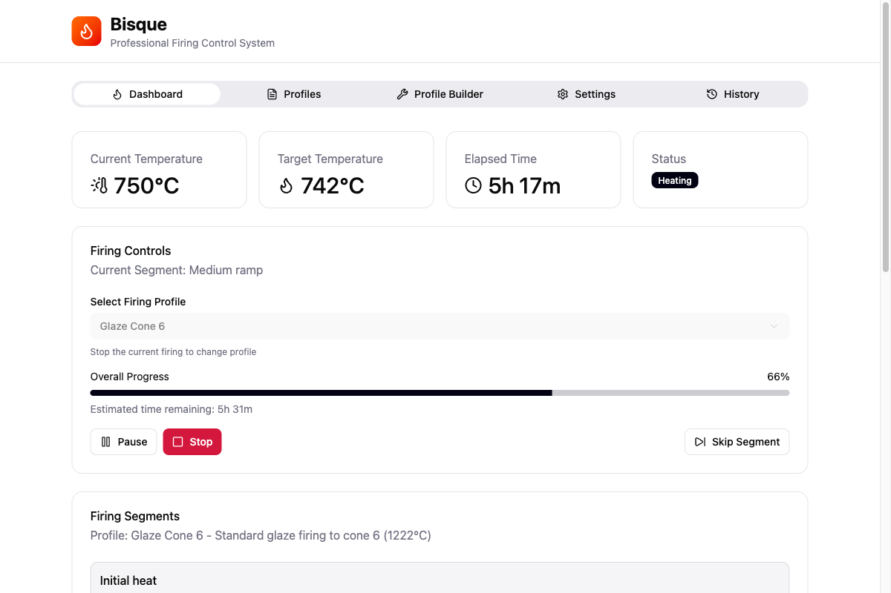
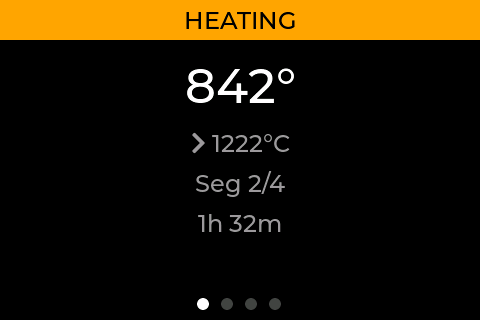
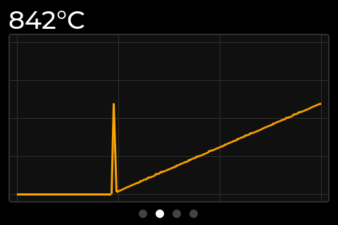
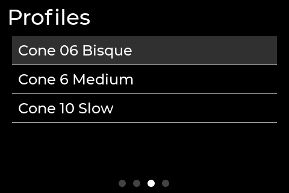
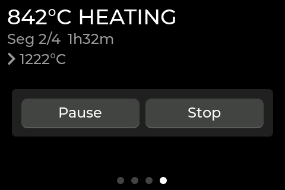
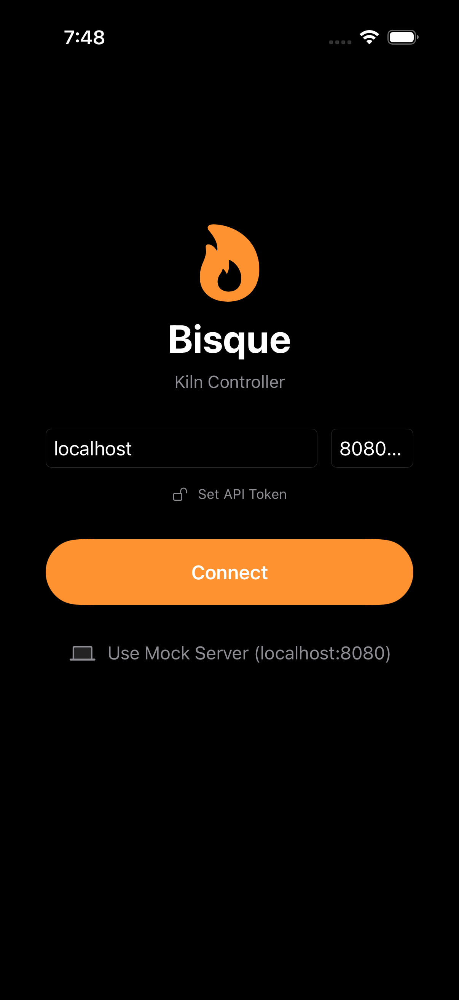

<p align="center">
  
</p>

<p align="center">
  <a href="https://github.com/BenSeverson/bisque/actions/workflows/build.yml"></a>
  
  <a href="LICENSE"></a>
</p>

## Features

**Temperature Control**
- PID controller with auto-tuning (Ziegler-Nichols relay method)
- 1-second control loop with time-proportional SSR output
- Thermocouple calibration offset

**Firing Profiles**
- Up to 20 custom profiles with 16 segments each (ramp rate, target temp, hold time)
- Orton cone firing (cones 022-13) with slow, medium, and fast heating speeds
- Delayed start

**Safety**
- Over-temperature protection (hardware max 1400 C, user-configurable limit)
- Thermocouple fault detection (open circuit, short to GND/VCC)
- Rate-of-rise monitoring (detects runaway >2x programmed rate)
- Not-rising detection (alerts if <10 C rise in 15 min)
- Emergency stop with immediate SSR cutoff

**Web Dashboard**
- Real-time temperature chart with profile overlay (React + Recharts)
- Profile builder with cone fire mode
- Firing history with CSV trace export and cost estimation
- Settings: calibration, safety limits, webhooks, API token

**iOS App**
- Full remote control (SwiftUI)
- Dynamic Island live activities during firing
- Local notifications for firing complete/error

**LCD Display**
- 3.5" TFT (480x320) with LVGL, 4 screens: home, chart, profiles, firing
- 3-button encoder navigation (up/down/select)

**Connectivity**
- Wi-Fi with mDNS (`bisque.local`)
- REST API with optional bearer token auth
- WebSocket for real-time streaming
- Webhook notifications (firing complete/error)

## Screenshots

**Web Dashboard** (React)
<p align="center">
  
</p>

**LCD Display** (LVGL on 3.5" TFT)
<p align="center">
  
  
  
  
</p>

**iOS App** (SwiftUI)
<p align="center">
  
</p>

## Bill of Materials

<details>
<summary>Expand</summary>

| Component | Description | Approx. Cost |
|-----------|-------------|:------------:|
| ESP32-S3-DevKitC-1 (N16R8) | Main controller, 16MB flash, 8MB PSRAM (44-pin, USB-C) | ~$10 |
| MAX31855 breakout | K-type thermocouple amplifier (SPI) | ~$15 |
| K-type thermocouple | High-temp probe, kiln rated | ~$15-30 |
| ST7796S 3.5" TFT LCD | 480x320 SPI display | ~$12 |
| SSR (e.g. SSR-40DA) | Solid state relay for kiln element | ~$10 |
| 3x tactile buttons | Up / Down / Select navigation | ~$1 |
| Piezo buzzer (optional) | Alarm output | ~$1 |
| Relay module (optional) | Vent fan control | ~$3 |

> **Safety warning:** Kilns operate at dangerous temperatures and voltages. Ensure all high-voltage wiring is performed by a qualified electrician. Use appropriate safety equipment and never leave a firing kiln unattended.

</details>

## Wiring

<details>
<summary>Expand</summary>

### SPI Bus (shared by thermocouple and display)

| Signal | ESP32-S3 GPIO |
|--------|:-------------:|
| MOSI   | 11            |
| MISO   | 13            |
| SCLK   | 12            |

### MAX31855 Thermocouple

| Signal | ESP32-S3 GPIO |
|--------|:-------------:|
| CS     | 10            |

### ST7796S LCD Display

| LCD Pin | ESP32-S3 GPIO | Notes |
|---------|:-------------:|-------|
| SDA     | 11            | SPI MOSI (data to display) |
| SCL     | 12            | SPI clock |
| CS      | 9             | Chip select |
| DC      | 46            | Data/Command |
| RST     | 3             | Reset |
| BL      | 8             | Backlight (active-high) |

### SSR Output

| Signal | ESP32-S3 GPIO |
|--------|:-------------:|
| SSR    | 17            |

### Navigation Buttons

| Button | ESP32-S3 GPIO | Notes |
|--------|:-------------:|-------|
| Up     | 4             | Active-low, internal pull-up |
| Down   | 5             | Active-low, internal pull-up |
| Select | 6             | Active-low, internal pull-up |

See also: [Wiring Diagram](docs/wiring-diagram.svg) | [Perfboard Layout](docs/perfboard-layout.svg)

</details>

## Getting Started

### Prerequisites

- [ESP-IDF v6.0](https://docs.espressif.com/projects/esp-idf/en/v6.0/esp32s3/get-started/)
- Node.js 18+
- [XcodeGen](https://github.com/yonaskolb/XcodeGen) (for iOS development)

### Firmware

```bash
# Build web UI assets first
cd web_ui && npm install && npm run build && cd ..

# Gzip assets for SPIFFS
gzip -k -9 spiffs_data/www/assets/*.js spiffs_data/www/assets/*.css

# Build and flash firmware
source ~/.espressif/v6.0/esp-idf/export.sh
idf.py build
idf.py flash monitor
```

### Web UI Development

```bash
cd web_ui
npm install
npm run dev    # Starts dev server with mock kiln simulator
```

### iOS App

```bash
# Generate Xcode project
cd ios/Bisque
xcodegen generate
open Bisque.xcodeproj
```

For simulator testing, start the mock server first:

```bash
cd web_ui && npm run mock-server   # HTTP + WebSocket on localhost:8080
```

In the iOS simulator, tap "Use Mock Server" on the connection screen.

<details>
<summary><strong>Simulator / Mock Server</strong></summary>

A mock kiln server simulates the full API (status, profiles, firing, settings, history, autotune, diagnostics) with realistic temperature physics so you can develop and test without hardware.

### Web UI development

The mock server runs automatically as a Vite plugin when you start the web UI dev server:

```bash
cd web_ui
npm run dev
```

The mock is enabled by default. To disable it and proxy to a real kiln instead:

```bash
VITE_MOCK=false npm run dev
```

Control simulation speed with `VITE_MOCK_SPEED` (default `60` = 60x real-time):

```bash
VITE_MOCK_SPEED=120 npm run dev
```

### iOS app development

A standalone mock server is available for testing the iOS app in the Xcode simulator:

```bash
cd web_ui
npm run mock-server
```

This starts an HTTP + WebSocket server on `localhost:8080`. To change the port or simulation speed:

```bash
MOCK_PORT=9000 MOCK_SPEED=120 npm run mock-server
```

### LCD Simulator

A standalone SDL2-based simulator renders the LVGL display UI on your desktop:

```bash
cd simulator
cmake -B build && cmake --build build
./build/bisque_sim
```

Requires SDL2 (`brew install sdl2` on macOS).

</details>

## Architecture

```
main/                 App entry point, FreeRTOS task creation
components/
  app_config/         Pin definitions, hardware constants
  thermocouple/       MAX31855 SPI driver
  pid_control/        PID controller + Ziegler-Nichols auto-tune
  firing_engine/      Multi-segment firing state machine
  safety/             Watchdog, over-temp, fault detection
  cone_table/         Orton cone temperature lookup (022-13)
  history/            Firing history + temperature traces (NVS)
  display/            ST7796S LCD + LVGL UI (4 screens)
  web_server/         REST API + WebSocket server
  wifi_manager/       Wi-Fi STA/AP + mDNS
web_ui/               React/TypeScript web dashboard
ios/Bisque/           SwiftUI iOS app
simulator/            LVGL SDL2 desktop simulator
docs/                 Wiring diagrams, screenshots
```

## License

[MIT](LICENSE)
